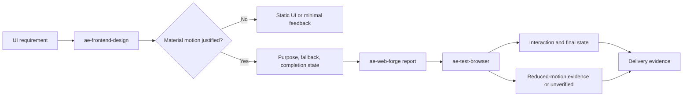

<!-- ae-codex:experience -->
# Frontend Motion Governance Experience

## Context

The frontend workflow already routed design, implementation, and browser acceptance across `ae-frontend-design`, `ae-web-forge`, and `ae-test-browser`. It did not require an implementer to explain why material motion exists, preserve a usable completion state, or report reduced-motion evidence.

## Decision

Extend the existing skills instead of creating a motion skill or adding an animation dependency. Static UI and minimal state feedback are the default. Timeline animation, exported animation assets, 3D/data visualization, and external runtimes remain target-project choices that need a task-relevant purpose and a platform-respecting fallback.

## Evidence Flow

`ae-graph-build` and `ae-graph-query` were also run against the distributed skill root as a shallow static inspection. They matched `ae-frontend-design/SKILL.md` and reported `store.written=false`. The Mermaid diagram above is therefore a human-readable process graph, not a claim that a persistent graph database or dynamic dependency graph was produced.

## Validation

- Focused motion-governance regression test: red before the implementation, green after it.
- `npm.cmd test` passed with 85 tests.
- `npm.cmd run check`, install smoke, artifact, mirror, and skill-contract checks passed.
- The root package and plugin manifest both resolve to version `0.3.3`.

## Reusable Lesson

Motion is not an independent visual upgrade. It is a decision-to-evidence chain: start from a static baseline, state the user-facing purpose, keep the final state usable, honor reduced-motion preferences, and make any unavailable browser proof explicit.
