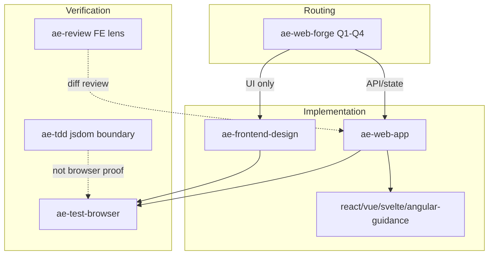

<!-- ae-codex:experience -->
# Frontend Skill Optimization Experience

## Context

The distributed frontend skills (`ae-frontend-design`, `ae-web-app`, `ae-web-forge`, `ae-test-browser`) already routed UI work, but implementation guidance was thin: React guidance was six generic bullets, Vue/Svelte/Angular had no dedicated references, accessibility and layout stability were implicit, and non-frontend skills (`ae-review`, `ae-tdd`, `ae-debug`) lacked frontend-specific lenses.

## Decision

Strengthen references in two releases without changing skill entrypoints:

1. **0.3.18** — Expand React/Vue guidance, frontend quality checklist, deployment readiness, debug quick map, and browser keyboard acceptance.
2. **0.3.19** — Add Svelte/Angular guidance, a `ae-review` Frontend Components / Styles lens, and TDD frontend harness notes.

Keep `ae-web-forge` four-question routing unchanged; route legacy or niche stacks through "match existing repository conventions".

## Skill Map (process graph)

## Validation

- Commits: `a51ef3c` (0.3.19 bundle includes 0.3.18 content in release notes)
- `node scripts/check-skill-mirror.mjs` — 120 files ok
- `npm test` — 105 pass on committed snapshot
- `node scripts/check-install-smoke.mjs` — distributable 0.3.19

Proof boundary: skill docs, mirror, and distribution contracts only — not runtime browser acceptance in target projects.

## Reusable Lessons

- Framework guidance works best as parallel four-section references (structure, defect traps, SSR/boundary, user-facing states) rather than one mega skill.
- Non-frontend skills should gain optional lenses (review profiles, TDD harness notes) instead of duplicating `ae-web-app` implementation rules.
- When two sessions share a worktree, stage version-only `package.json` if the other session owns check-script layering.
