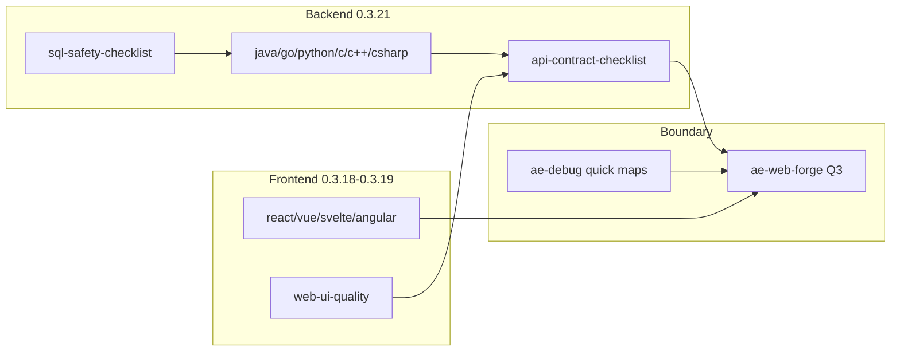

<!-- ae-codex:experience -->
# Fullstack Skill Optimization Experience

## Context

After frontend guidance reached four frameworks (0.3.18–0.3.19), backend-facing skills remained asymmetric: `ae-backend` had ~26 lines of framework-agnostic references, no language-level defect traps, a five-line API contract checklist, no SQL safety reference, and `ae-debug` lacked backend and FE/BE boundary quick maps.

User requirement: optimize all skills for fullstack work with backend priority languages Java, Go, Python, C, C++, C#; other backend languages must remain compatible via repository-convention fallback.

## Decision

Deliver as **0.3.21** in one plan (`docs/ae/plans/2026-08-11-002-fullstack-skill-optimization-plan.md`):

| Area | Change |
| --- | --- |
| `ae-backend` | Six language guidance files + stack-selection workflow step |
| Contract | Expand `api-contract-checklist.md` with Frontend-Backend Alignment; wire `ae-web-app` / `ae-web-forge` |
| `ae-debug` | Backend Failure Quick Map + Frontend-Backend Boundary Quick Map |
| `ae-sql` | New `sql-safety-checklist.md` with operation risk tiers |

Do not duplicate `ae-design` mapping tables at implementation layer; keep design contracts upstream.

## Skill Symmetry Graph

## Validation

- Mirror: 127 files, `check-skill-mirror` ok
- `check-skill-contract`: 80 skills, 0 errors
- `check-release-notes`: 0.3.21 bilingual entries
- `npm test`, `npm run check`, `npm run check:smoke` — pass (first parallel smoke race retried serially)

Proof boundary: skill and distribution contracts; not target-project API, database, or deployment acceptance.

## Reusable Lessons

- Fullstack parity means matching reference *shape* (structure, traps, boundary, contract) across frontend and backend skills, not equal line counts per language.
- Implementation-layer contract checklists should point to `ae-swagger-parser` and `ae-test-api` instead of re-documenting OpenAPI tooling.
- Coordinate version bumps when structural refactor (0.3.20) lands mid-task: stack on latest main and use zero-overlap file sets between sessions.
