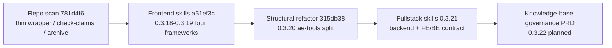

<!-- ae-codex:reference -->
# Maintainer Artifact Graph (2026-08-11)

Curated map of the August 2026 optimization wave: initial repo scan (`781d4f6`), frontend skill guidance (`a51ef3c` / 0.3.18–0.3.19), structural refactor (`315db38` / 0.3.20), and fullstack skill optimization (0.3.21). For machine-readable edges see `docs/08-ai-memory/00-registry.json`.

## Delivery timeline



## Code module graph (ae-tools, post-0.3.20)

Maintainer import DAG — query live imports with:

`node scripts/ae-tools.mjs ae-graph-build --root plugins/ai-agent-engine-codex/scripts/ae-tools --no-write`

```mermaid
flowchart TB
  entry["ae-tools.mjs dispatcher"]
  utils["utils.mjs"]
  git["git.mjs"]
  yaml["yaml.mjs"]
  graph["graph.mjs"]
  evidence["evidence.mjs"]
  review["review.mjs"]
  tasks["tasks.mjs"]
  init["init.mjs"]
  entry --> review
  entry --> tasks
  entry --> init
  review --> evidence
  review --> git
  review --> graph
  tasks --> graph
  tasks --> yaml
  graph --> git
  evidence --> git
  yaml --> utils
  git --> utils
  graph --> utils
  init --> utils
```

## Artifact relations

| From | Relation | To | Role |
| --- | --- | --- | --- |
| `docs/ae/plans/2026-08-11-001-structural-debt-refactor-plan.md` | implements | `plugins/.../scripts/ae-tools/*.mjs` | Module split + layered check |
| `docs/ae/experience/2026-08-11-structural-debt-refactor.md` | records | above plan | Validation + lessons |
| `docs/ae/experience/2026-08-11-frontend-skill-optimization.md` | records | `a51ef3c` / 0.3.18–0.3.19 | Four-framework + review/TDD/debug lenses |
| `docs/ae/references/ae-tools-module-layout.md` | references | module DAG | Maintainer contract |
| `docs/ae/plans/2026-08-11-002-fullstack-skill-optimization-plan.md` | implements | `ae-backend` / `ae-sql` / web skills | Language + contract guides |
| `docs/ae/experience/2026-08-11-fullstack-skill-optimization.md` | records | above plan | Mirror + contract proof |
| `docs/08-ai-memory/05-decision-log.md` | documents | both plans | Durable decisions |
| `docs/08-ai-memory/03-key-workflows.md` | implements | check layers + skill sync | Release workflow |
| `README.md` §后续持续优化方向 | references | completed + next items | Roadmap |
| `docs/00-process/archive/2026-08/fullstack-skill-optimization/summary.md` | archives | fullstack plan | Process closure |
| `docs/ae/prds/2026-08-11-knowledge-base-governance-prd.md` | supersedes | dual requirements channel | Next batch 0.3.22 |

## Skill mirror invariant

Every distributable skill change touches **both**:

- `plugins/ai-agent-engine-codex/skills/**` (source)
- `.agents/skills/**` (mirror)

Verified by `node scripts/check-skill-mirror.mjs` in `npm run check:contracts`.

## Update procedure

When a new delivery lands:

1. Append decision + workflow rows to `docs/08-ai-memory/` (minimal files).
2. Add `documents` / `relations` entries to `00-registry.json`.
3. Extend this graph or archive the dated section to `docs/00-process/archive/YYYY-MM/`.
4. Run `node scripts/check-memory-knowledge-contract.mjs --root .` (included in `npm run check:contracts`).
