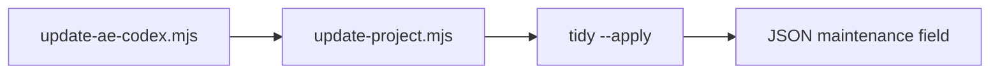
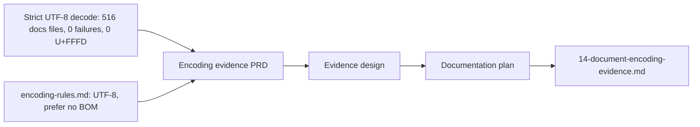
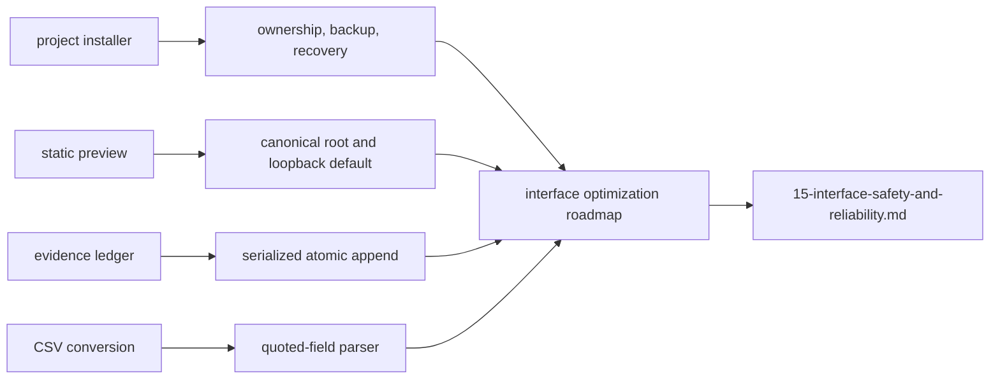
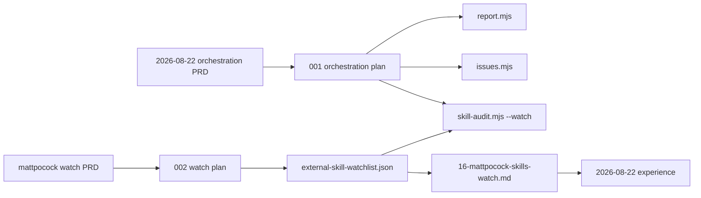

<!-- ae-codex:reference -->
# Maintainer Artifact Graph (2026-08-11, extended 2026-08-22)

Curated map of the August 2026 optimization wave through Cursor dual-client discovery (`cd20d47` / 0.3.30) and the 0.3.31–0.3.34 interface, orchestration, and external-skill watch batch. For machine-readable edges see `docs/08-ai-memory/00-registry.json`.

## Delivery timeline


## Code module graph (ae-tools, post-0.3.20)

Maintainer import DAG — query live imports with:

`node scripts/ae-tools.mjs ae-graph-build --root plugins/ai-agent-engine-codex/scripts/ae-tools --no-write`

```mermaid
flowchart TB
  entry["ae-tools.mjs dispatcher"]
  utils["utils.mjs"]
  git["git.mjs"]
  yaml["yaml.mjs"]
  graph["graph.mjs"]
  evidence["evidence.mjs"]
  review["review.mjs"]
  tasks["tasks.mjs"]
  init["init.mjs"]
  tidy["tidy.mjs"]
  report["report.mjs"]
  issues["issues.mjs"]
  audit["skill-audit.mjs"]
  entry --> review
  entry --> tasks
  entry --> init
  entry --> tidy
  entry --> report
  entry --> issues
  entry --> audit
  review --> evidence
  review --> git
  review --> graph
  tasks --> graph
  tasks --> yaml
  report --> utils
  issues --> utils
  audit --> utils
  graph --> git
  evidence --> git
  yaml --> utils
  git --> utils
  graph --> utils
  init --> utils
  tidy --> utils
```

## Update → tidy loop (0.3.24+)



## Artifact relations

| From | Relation | To | Role |
| --- | --- | --- | --- |
| `docs/ae/plans/2026-08-11-001-structural-debt-refactor-plan.md` | implements | `plugins/.../scripts/ae-tools/*.mjs` | Module split + layered check |
| `docs/ae/experience/2026-08-11-structural-debt-refactor.md` | records | above plan | Validation + lessons |
| `docs/ae/experience/2026-08-11-frontend-skill-optimization.md` | records | `a51ef3c` / 0.3.18–0.3.19 | Four-framework + review/TDD/debug lenses |
| `docs/ae/references/ae-tools-module-layout.md` | references | module DAG | Maintainer contract |
| `docs/ae/plans/2026-08-11-002-fullstack-skill-optimization-plan.md` | implements | `ae-backend` / `ae-sql` / web skills | Language + contract guides |
| `docs/ae/experience/2026-08-11-fullstack-skill-optimization.md` | records | above plan | Mirror + contract proof |
| `docs/08-ai-memory/05-decision-log.md` | documents | both plans | Durable decisions |
| `docs/08-ai-memory/03-key-workflows.md` | implements | check layers + skill sync | Release workflow |
| `README.md` §后续持续优化方向 | references | completed + next items | Roadmap |
| `docs/00-process/archive/2026-08/fullstack-skill-optimization/summary.md` | archives | fullstack plan | Process closure |
| `docs/ae/plans/2026-08-11-003-knowledge-base-governance-plan.md` | implements | init/recovery/review + skills | Canonical prds + evidence fingerprint |
| `docs/ae/experience/2026-08-11-knowledge-base-governance.md` | records | above plan | Validation + deferred batch-two items |
| `docs/00-process/archive/2026-08/knowledge-base-governance/summary.md` | archives | kb governance plan | Process closure |
| `docs/ae/plans/2026-08-11-004-governance-batch-two-plan.md` | implements | `tidy.mjs` + skill refinements | Executable retention + gate fix |
| `docs/ae/experience/2026-08-11-governance-batch-two.md` | records | above plan | Tidy runs + calibration signals |
| `docs/00-process/archive/2026-08/governance-batch-two/summary.md` | archives | batch-two plan | Process closure |
| `docs/ae/plans/2026-08-11-005-governance-batch-three-plan.md` | implements | `tidy.mjs` merge + `update-project.mjs` | Auto-maintenance loop |
| `docs/ae/experience/2026-08-11-governance-batch-three.md` | records | above plan | Merge + consumer hook |
| `docs/00-process/archive/2026-08/governance-batch-three/summary.md` | archives | batch-three plan | Process closure |
| `plugins/.../update-project.mjs` | invokes | `tidy --apply` | Post-install maintenance (unless `--no-tidy`) |
| `plugins/.../ae-help/references/capability-catalog.json` | documents | `artifactPaths.requirements` → prds | Help tier artifact routing |
| `docs/ae/plans/2026-08-11-006-governance-batch-four-plan.md` | implements | `scripts/check-release-notes.mjs` + `CHANGELOG.md`/`CHANGELOG.en.md` | Release-notes split, five-entry README window |
| `docs/ae/experience/2026-08-11-governance-batch-four.md` | records | above plan | Migration checks + deferred dispositions |
| `docs/00-process/archive/2026-08/governance-batch-four/summary.md` | archives | batch-four plan | Process closure |
| `docs/ae/plans/2026-08-11-007-prds-artifact-path-unification-plan.md` | implements | catalog `artifactPath` + `artifact-contract.md` + `scope-detection.md` (0.3.25) | Requirements-path declarations on prds |
| `docs/00-process/archive/2026-08/prds-artifact-path-unification/summary.md` | archives | 007 plan | Process closure + finding adjudication |
| `docs/99-archive/2026-08/memory-distillation/README.md` | archives | `05-decision-log.md` / `03-key-workflows.md` shards | Memory budget convergence |
| `docs/ae/experience/2026-08-11-memory-distillation.md` | records | distillation shards + registry boundary | Rotation workflow lessons |
| `docs/ae/plans/2026-08-13-002-cursor-user-skill-discovery-plan.md` | implements | `global-install.mjs` publish-cursor-skills | Cursor copies after personal plugin |
| `docs/ae/experience/2026-08-13-cursor-user-skill-discovery.md` | records | 0.3.29 links superseded by 0.3.30 copies | Live `/ae` probe |
| `docs/ae/references/global-ae-install-contract.md` | documents | Codex personal plugin + Cursor copies | Dual discovery surfaces |
| `docs/00-process/archive/2026-08/cursor-user-skill-discovery/summary.md` | archives | Cursor discovery plan | Process closure |

## Skill mirror invariant

Every distributable skill change touches **both**:

- `plugins/ai-agent-engine-codex/skills/**` (source)
- `.ae-source/skills/**` (distribution-source maintenance mirror)

Consumer installs still receive `.agents/skills`. Cursor user discovery after 0.3.30 is a separate copy under `~/.cursor/skills/ae-*`, not that mirror.

Verified by `node scripts/check-skill-mirror.mjs` in `npm run check:contracts`.

## Update procedure

When a new delivery lands:

1. Append decision + workflow rows to `docs/08-ai-memory/` (minimal files).
2. Add `documents` / `relations` entries to `00-registry.json`.
3. Extend this graph or archive the dated section to `docs/00-process/archive/YYYY-MM/`.
4. Run `node scripts/check-memory-knowledge-contract.mjs --root .` (included in `npm run check:contracts`).

## Document Encoding Evidence (2026-08-17)

The encoding evidence is a bounded maintenance record, not a generated graph or a claim that terminal rendering is healthy.



| From | Relation | To | Role |
| --- | --- | --- | --- |
| Strict decoder snapshot | documents | `docs/ae/prds/2026-08-17-document-encoding-evidence-governance-prd.md` | Dated proof: 516 files, 0 fatal-decode failures, 0 replacement-character files |
| `docs/00-process/templates/encoding-rules.md` | governs | `docs/08-ai-memory/14-document-encoding-evidence.md` | Existing UTF-8/no-BOM and no-preview-rewrite rule |
| `docs/08-ai-memory/14-document-encoding-evidence.md` | references | PRD, design, and plan above | Declared machine-readable relations in `00-registry.json` |

## Interface Optimization Review (2026-08-17)



| From | Relation | To | Role |
| --- | --- | --- | --- |
| `scripts/install-project.mjs` | requires | ownership-aware replacement | Protect modified consumer components and recover from partial installation |
| `ae-tools/static-server.mjs` | requires | canonical root + loopback default | Keep a local preview local and contained |
| `ae-tools/evidence.mjs` | requires | serialized atomic ledger updates | Preserve evidence-chain integrity across concurrent writers |
| `ae-tools/markitdown.mjs` | requires | quoted-field parsing | Preserve CSV table meaning in Markdown output |
| `docs/ae/solutions/2026-08-17-interface-optimization-roadmap.md` | documents | `docs/08-ai-memory/15-interface-safety-and-reliability.md` | Declared durable findings and implementation sequence |

## Orchestration, tracker, and watch (0.3.32–0.3.34)



| From | Relation | To | Role |
| --- | --- | --- | --- |
| `docs/ae/prds/2026-08-22-codex-orchestration-reporting-issue-tracker-skill-governance-prd.md` | documents | `report.mjs` / `issues.mjs` / `skill-audit.mjs` | Offline report, local issues, static portfolio audit |
| `docs/ae/plans/2026-08-22-001-codex-orchestration-reporting-issue-tracker-skill-governance-plan.md` | implements | plugin scripts + catalogs | 0.3.32–0.3.33 |
| `docs/ae/prds/2026-08-22-mattpocock-skills-watch-prd.md` | documents | watchlist + `--watch` | Pinned freshness, no auto-write |
| `docs/ae/plans/2026-08-22-002-mattpocock-skills-watch-plan.md` | implements | `skill-audit.mjs` + memory 16 | 0.3.34 |
| `docs/ae/references/external-skill-watchlist.json` | records | adopted AE skill mappings | Recheck input |
| `docs/08-ai-memory/16-mattpocock-skills-watch.md` | documents | watchlist and recheck workflow | Durable memory |
| `docs/ae/experience/2026-08-22-codex-orchestration-and-mattpocock-watch.md` | records | 0.3.32–0.3.34 | Authority and proof boundary |
| `docs/ae/issues/AEI-20260822-003.md` | tracks | later stale `--watch` results | Follow-up only |
