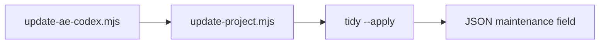

<!-- ae-codex:reference -->
# Maintainer Artifact Graph (2026-08-11)

Curated map of the August 2026 optimization wave: initial repo scan (`781d4f6`), frontend skill guidance (`a51ef3c` / 0.3.18–0.3.19), structural refactor (`315db38` / 0.3.20), fullstack skill optimization (`e2621b7` / 0.3.21), knowledge-base governance batches one–three (`53c94aa` / 0.3.22 → `6721ce3` / 0.3.23–0.3.24), governance batch four plus prds path unification (`d564fa6` / 0.3.25: release-notes split into changelogs, process-archive closeout, requirements-path declarations), and the 2026-08-11 memory distillation (05/03 rotated within the 15KB budget). For machine-readable edges see `docs/08-ai-memory/00-registry.json`.

## Delivery timeline

```mermaid
flowchart LR
  scan["Repo scan 781d4f6<br/>thin wrapper / check-claims / archive"]
  fe["Frontend skills a51ef3c<br/>0.3.18-0.3.19 four frameworks"]
  struct["Structural refactor 315db38<br/>0.3.20 ae-tools split"]
  full["Fullstack skills 0.3.21<br/>backend + FE/BE contract"]
  kb1["KB governance batch 1<br/>0.3.22 53c94aa"]
  kb2["KB governance batch 2<br/>0.3.23 tidy + skills"]
  kb3["KB governance batch 3<br/>0.3.24 auto-maintain"]
  kb4["KB governance batch 4<br/>release-notes split d564fa6"]
  prds["prds path unification<br/>0.3.25 d564fa6"]
  distill["Memory distillation<br/>05/03 within 15KB budget"]
  scan --> fe --> struct --> full --> kb1 --> kb2 --> kb3 --> kb4 --> prds --> distill
```



## Code module graph (ae-tools, post-0.3.20)

Maintainer import DAG — query live imports with:

`node scripts/ae-tools.mjs ae-graph-build --root plugins/ai-agent-engine-codex/scripts/ae-tools --no-write`

```mermaid
flowchart TB
  entry["ae-tools.mjs dispatcher"]
  utils["utils.mjs"]
  git["git.mjs"]
  yaml["yaml.mjs"]
  graph["graph.mjs"]
  evidence["evidence.mjs"]
  review["review.mjs"]
  tasks["tasks.mjs"]
  init["init.mjs"]
  tidy["tidy.mjs"]
  entry --> review
  entry --> tasks
  entry --> init
  entry --> tidy
  review --> evidence
  review --> git
  review --> graph
  tasks --> graph
  tasks --> yaml
  graph --> git
  evidence --> git
  yaml --> utils
  git --> utils
  graph --> utils
  init --> utils
  tidy --> utils
```

## Update → tidy loop (0.3.24+)



## Artifact relations

| From | Relation | To | Role |
| --- | --- | --- | --- |
| `docs/ae/plans/2026-08-11-001-structural-debt-refactor-plan.md` | implements | `plugins/.../scripts/ae-tools/*.mjs` | Module split + layered check |
| `docs/ae/experience/2026-08-11-structural-debt-refactor.md` | records | above plan | Validation + lessons |
| `docs/ae/experience/2026-08-11-frontend-skill-optimization.md` | records | `a51ef3c` / 0.3.18–0.3.19 | Four-framework + review/TDD/debug lenses |
| `docs/ae/references/ae-tools-module-layout.md` | references | module DAG | Maintainer contract |
| `docs/ae/plans/2026-08-11-002-fullstack-skill-optimization-plan.md` | implements | `ae-backend` / `ae-sql` / web skills | Language + contract guides |
| `docs/ae/experience/2026-08-11-fullstack-skill-optimization.md` | records | above plan | Mirror + contract proof |
| `docs/08-ai-memory/05-decision-log.md` | documents | both plans | Durable decisions |
| `docs/08-ai-memory/03-key-workflows.md` | implements | check layers + skill sync | Release workflow |
| `README.md` §后续持续优化方向 | references | completed + next items | Roadmap |
| `docs/00-process/archive/2026-08/fullstack-skill-optimization/summary.md` | archives | fullstack plan | Process closure |
| `docs/ae/plans/2026-08-11-003-knowledge-base-governance-plan.md` | implements | init/recovery/review + skills | Canonical prds + evidence fingerprint |
| `docs/ae/experience/2026-08-11-knowledge-base-governance.md` | records | above plan | Validation + deferred batch-two items |
| `docs/00-process/archive/2026-08/knowledge-base-governance/summary.md` | archives | kb governance plan | Process closure |
| `docs/ae/plans/2026-08-11-004-governance-batch-two-plan.md` | implements | `tidy.mjs` + skill refinements | Executable retention + gate fix |
| `docs/ae/experience/2026-08-11-governance-batch-two.md` | records | above plan | Tidy runs + calibration signals |
| `docs/00-process/archive/2026-08/governance-batch-two/summary.md` | archives | batch-two plan | Process closure |
| `docs/ae/plans/2026-08-11-005-governance-batch-three-plan.md` | implements | `tidy.mjs` merge + `update-project.mjs` | Auto-maintenance loop |
| `docs/ae/experience/2026-08-11-governance-batch-three.md` | records | above plan | Merge + consumer hook |
| `docs/00-process/archive/2026-08/governance-batch-three/summary.md` | archives | batch-three plan | Process closure |
| `plugins/.../update-project.mjs` | invokes | `tidy --apply` | Post-install maintenance (unless `--no-tidy`) |
| `plugins/.../ae-help/references/capability-catalog.json` | documents | `artifactPaths.requirements` → prds | Help tier artifact routing |
| `docs/ae/plans/2026-08-11-006-governance-batch-four-plan.md` | implements | `scripts/check-release-notes.mjs` + `CHANGELOG.md`/`CHANGELOG.en.md` | Release-notes split, five-entry README window |
| `docs/ae/experience/2026-08-11-governance-batch-four.md` | records | above plan | Migration checks + deferred dispositions |
| `docs/00-process/archive/2026-08/governance-batch-four/summary.md` | archives | batch-four plan | Process closure |
| `docs/ae/plans/2026-08-11-007-prds-artifact-path-unification-plan.md` | implements | catalog `artifactPath` + `artifact-contract.md` + `scope-detection.md` (0.3.25) | Requirements-path declarations on prds |
| `docs/00-process/archive/2026-08/prds-artifact-path-unification/summary.md` | archives | 007 plan | Process closure + finding adjudication |
| `docs/99-archive/2026-08/memory-distillation/README.md` | archives | `05-decision-log.md` / `03-key-workflows.md` shards | Memory budget convergence |
| `docs/ae/experience/2026-08-11-memory-distillation.md` | records | distillation shards + registry boundary | Rotation workflow lessons |

## Skill mirror invariant

Every distributable skill change touches **both**:

- `plugins/ai-agent-engine-codex/skills/**` (source)
- `.agents/skills/**` (mirror)

Verified by `node scripts/check-skill-mirror.mjs` in `npm run check:contracts`.

## Update procedure

When a new delivery lands:

1. Append decision + workflow rows to `docs/08-ai-memory/` (minimal files).
2. Add `documents` / `relations` entries to `00-registry.json`.
3. Extend this graph or archive the dated section to `docs/00-process/archive/YYYY-MM/`.
4. Run `node scripts/check-memory-knowledge-contract.mjs --root .` (included in `npm run check:contracts`).
